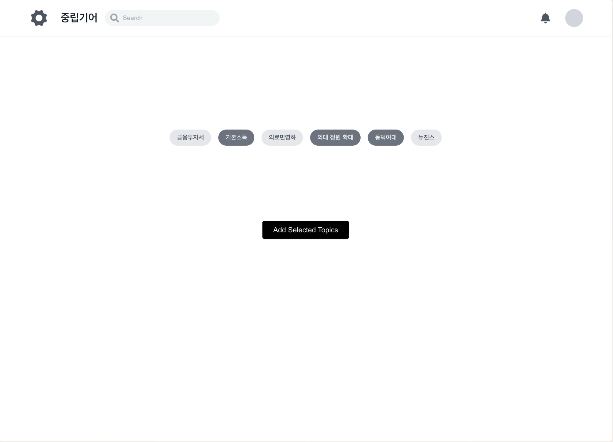
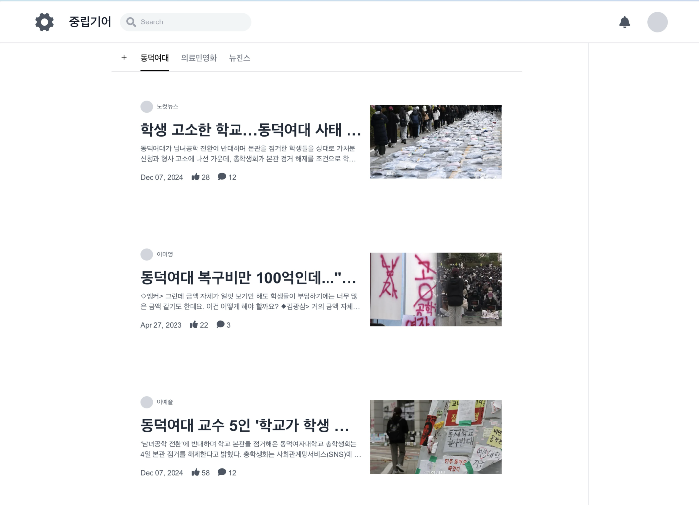
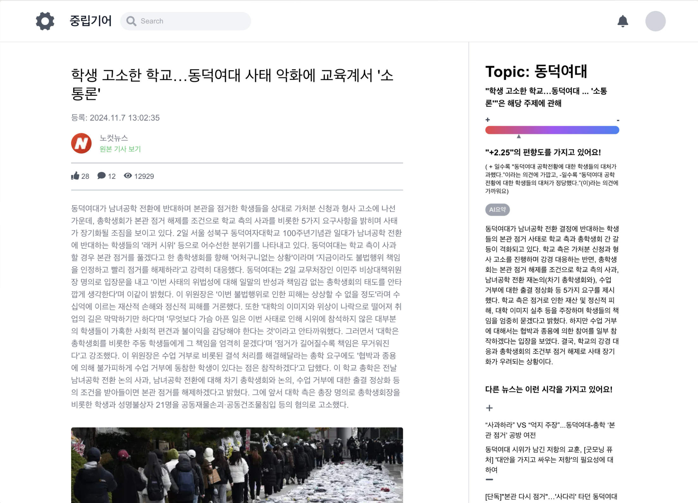

# 1. 개요. 프로젝트 "중립기어"

'중립기어' 뉴스 플랫폼은 우리가 마주하는 자료들의 편향성을 측정, 우리에게 제공하는 것을 목표로 한다. 논란이 되는 주제들을 모아 관리하며 열람한 자료의 쟁점과 편향 정도, 반대 의견을 표시해 준다. 이로써 사용자는 비판적 태도를 갖고 사건을 종합적으로 바라보게 된다.

# 2. 설치 및 환경 설정

## 1. Frontend: `app/` (Next.js)

- **Node.js Version**: 22.9.0
- **Framework**: Next.js 15

1. `app/` 디렉토리로 이동합니다:

   ```bash
   cd app/
   ```

2. 필요한 패키지를 설치합니다:

   ```bash
   npm install
   ```

3. 설치 완료 후, 빌드 및 서버를 실행합니다:
   ```bash
   npm run build
   npm run start
   ```

---

## 2. Backend: `backend/` (Flask)

1. `backend/` 디렉토리로 이동합니다:

   ```bash
   cd backend/
   ```

2. Docker Compose를 사용하여 컨테이너를 실행합니다:

   ```bash
   docker-compose up -d
   ```

3. 서버가 실행됩니다:
   - URL: [http://0.0.0.0:8000](http://0.0.0.0:8000)

# 3. 사용 방법 및 파일 구조

1. **토픽 선택 페이지**  
   

   - AI가 분석한 최근 논쟁이 되는 토픽들을 선택할 수 있도록 표시합니다.

2. **메인 페이지**  
   

   - 선택한 토픽에 따라 관련 기사들을 보여줍니다.

3. **기사 페이지**  
   
   - 해당 기사의 내용을 확인할 수 있으며, 다음과 같은 정보도 함께 제공합니다:
     - AI가 분석한 해당 기사의 진영
     - AI 요약
     - 다른 뉴스들의 시각

# 4. 데이터베이스/CSV

```
backend/
├── app/
│   ├── __init__.py
│   ├── main/
│   │   ├── __init__.py
│   │   ├── routes.py
│   │   ├── utils.py
│   ├── models/
│   │   ├── __init__.py
│   │   ├── news.py
│   │   ├── user.py
│   ├── services/
│   │   ├── __init__.py
│   │   ├── llm_service.py
│   │   ├── news_scraper.py
│   ├── templates/
│   ├── static/
│   ├── config.py
│   ├── extensions.py
├── migrations/
├── tests/
│   ├── __init__.py
│   ├── test_routes.py
│   ├── test_llm_service.py
├── requirements.txt
├── Dockerfile
├── docker-compose.yml
├── README.md
├── .env
├── .gitignore
```

# 5. 모델 및 알고리즘

> import pandas as pd
> from sentence_transformers import SentenceTransformer, util
> import google.generativeai as genai
> multi-qa-MiniLM-L6-cos-v1
> def calculate_article_bias(news_article, db, model_name="multi-qa-MiniLM-L6-cos-v1", threshold=0.5):
> 에서 모델 로드

모델을 이용해 주제를 추출한 후,
주제 에 맞는 텍스트를 RAG을 이용해 더욱 정확한 정보와 편향도, 다른 뉴스를 추천함.

# 6. 한계점 및 개선방안

## 미구현

main page에서 토픽을 AI가 분석하여 현재까지 사건의 진행 상황, 각 진영의 주장 및 근거 등을 AI로 분석하여 표시하려 하였으나 시간 부족을 원인으로 구현하지 못하였습니다.

## API 연결

마찬가지로 시간 부족의 문제로 각각 backend와 frontend application은 완성되었으나, 이를 연결하는 과정에서 너무 많은 시간이 소요되어, dummy data로 대체하여 구현을 완료하였습니다.

## 기능

- 어느 부분에서 편향이 크게 드러났는지 설명 부족, 모델 튜닝을 통해 개선 필요
- 아직까지는 데이터를 사람이 직접 로드해야 작동, 크롤링을 통해 실시간으로 핫 토픽을 파악 및 편향도 자동 측정
- 뉴스 플랫폼 자체로서의 편의성 부족. 많은 기능이 더 추가되어야 함.
- 처음 생각했던 것은 크롬 익스텐션 방식의 작동, 이를 통해 저작권 문제를 해결하여야 함.

# 라이선스

Apache 2.0
